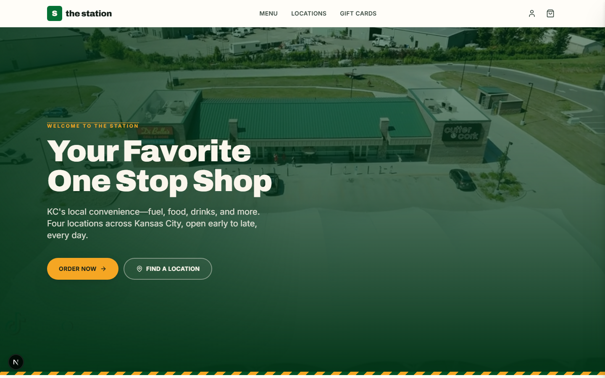
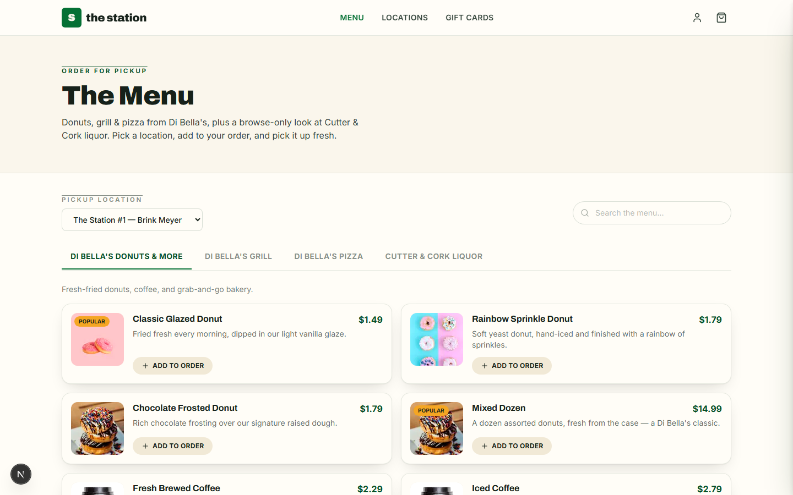
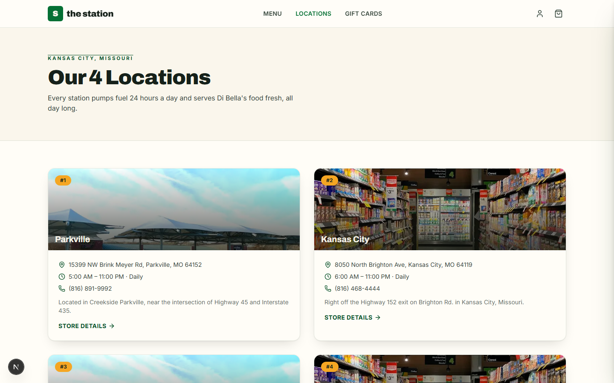
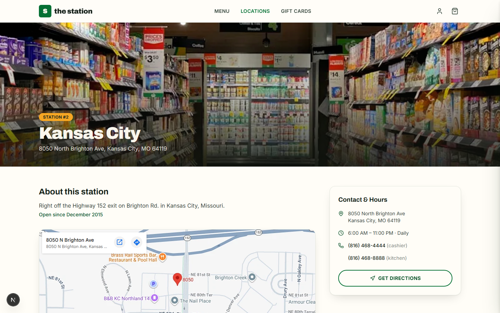
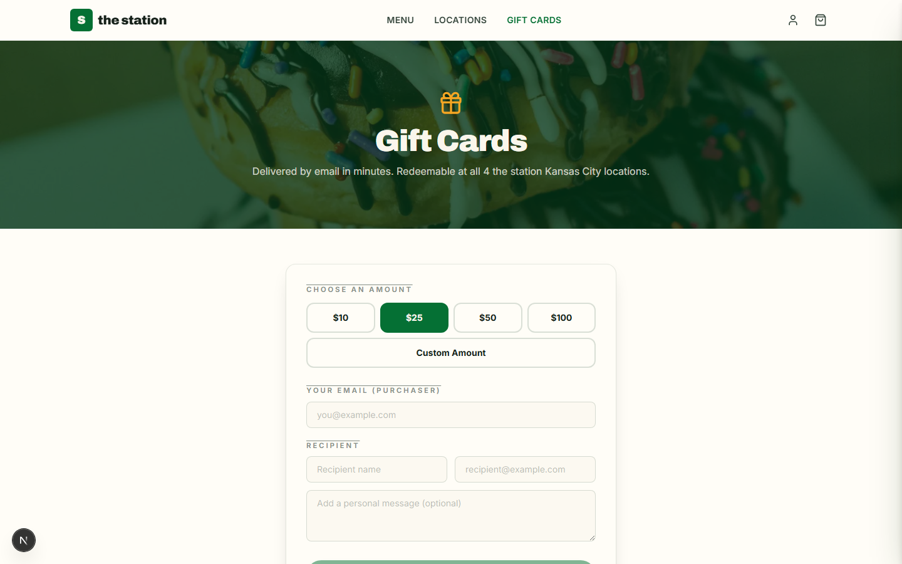

# the station — Digital Ordering & Gift Card Prototype

A pitch-ready concept demo by **SeJo Labs** for **the station**, a 4-location
Kansas City convenience store / gas station chain ("Your Favorite One Stop
Shop" — fuel, Di Bella's food, and Cutter & Cork liquor).

Built on real business data scraped from [thestationkc.com](https://thestationkc.com):
actual addresses, phone numbers, hours, opening dates, the real hero video,
and the real storefront photography — supplemented with licensed Unsplash
stock where the source site didn't have usable imagery (per-item food shots,
generic store aisle, fuel nozzle).

---

## Quick start

```bash
npm install
npm run dev
```

Open **http://localhost:3000**.

> Runs fully without any API keys: locations/menu are seeded locally, and
> checkout/gift-card/auth flows fall back to safe local/demo behavior when
> Supabase, Stripe, or Resend aren't configured (see **Going live** below).

### Screenshots

| | |
|---|---|
|  |  |
|  |  |
|  | |

---

## What's inside (Phase 1 MVP)

**Landing (`/`)** — hero video (the station's own drone footage of Brink
Meyer, with a static-photo fallback if the video 404s), tagline overlay,
Order/Locations CTAs, feature grid (Donuts / Grill & Pizza / Liquor / Fuel).

**Locations (`/locations`, `/locations/[slug]`)** — all 4 real KC locations
(Brink Meyer, Brighton, Stark, Homer) with real addresses, phone numbers
(cashier + kitchen lines), hours, and opening dates. Detail pages embed a
live Google Map, list mocked fuel prices by grade, and link out to Di
Bella's real per-location menu on dibellasfood.com.

**Fuel (`/fuel`)** — 24-hour fuel summary across all 4 stores with per-grade
pricing (illustrative — the real site doesn't expose live prices).

**Menu (`/menu`)** — Di Bella's Donuts & More, Di Bella's Grill, Di Bella's
Pizza, and Cutter & Cork Liquor, with location picker, category tabs, live
search/filter, and add-to-order. **Liquor is browse-only** (no online sale,
21+ in-store per Phase 1 scope) — the same items render with an "In-store
purchase only" badge instead of an Add button.

**Cart + Checkout** — Zustand cart store with a slide-in drawer, pickup-only
checkout (name/email/phone), and a real **Stripe Checkout Session** in test
mode when `STRIPE_SECRET_KEY` is set. Without a key, checkout completes
through a mock success flow so the UX is fully demoable offline. Order
history is written to `localStorage` and shown on `/account`.

**Gift Cards (`/gift-cards`)** — $10/25/50/100 presets or any custom amount
($5–$500), Stripe Checkout (or mock flow), a generated redemption code
(`STN-XXXX-XXXX-XXXX`), and email delivery via **Resend** when
`RESEND_API_KEY` is set (otherwise the send is logged server-side and the
code is always shown on-screen as a demo-safe fallback).

**Auth + Account (`/account`)** — Supabase magic-link email + Google OAuth
when Supabase env vars are set; a local demo auth flow (with an explicit
"demo mode" label and one-click verify) when they aren't. `/account` shows
gift-card balances and order history for the signed-in email.

**PWA** — `manifest.webmanifest`, a generated icon set in brand green
(`public/icons/`), and a service worker (`public/sw.js`, registered in
production builds only) caching the app shell for installability.

---

## Tech

Next.js 16 (App Router, Turbopack) · React 19 · TypeScript (strict) ·
Tailwind CSS v4 · Zustand · Framer Motion · lucide-react ·
`@supabase/supabase-js` + `@supabase/ssr` · `stripe` + `@stripe/stripe-js` ·
Resend (via REST, no SDK dependency).

## Project layout

```
public/images/          real thestationkc.com photos/video + Unsplash stock
public/icons/           generated PWA icon set (brand green)
src/data/                brand.ts, locations.ts (real scraped data), menu.ts
src/lib/                 cart/auth stores, format helpers, Stripe/Supabase/
                         Resend clients, local order & gift-card "backend"
src/app/                 routes (see below)
src/components/         Header, Footer, Hero, MenuExplorer, CartDrawer,
                         AuthModal, location/menu/gift-card UI
```

Routes: `/`, `/menu`, `/fuel`, `/locations`, `/locations/[slug]`,
`/checkout`, `/checkout/success`, `/checkout/cancel`, `/gift-cards`,
`/gift-cards/success`, `/account`, plus `/api/checkout`,
`/api/gift-cards/checkout`, `/api/gift-cards/deliver`.

---

## Going live with real backends (optional)

The prototype is intentionally self-contained — every integration below is
additive. Copy `.env.example` to `.env.local` and fill in what you need:

1. **Supabase (auth + persistence).** Create a project, run
   `supabase-schema.sql`-equivalent setup for `orders`/`gift_cards` tables,
   enable Email OTP + Google OAuth under Authentication, then set
   `NEXT_PUBLIC_SUPABASE_URL` / `NEXT_PUBLIC_SUPABASE_ANON_KEY`.
2. **Stripe (payments).** Grab test keys from the Stripe dashboard and set
   `STRIPE_SECRET_KEY` / `NEXT_PUBLIC_STRIPE_PUBLISHABLE_KEY`. Checkout and
   gift-card purchase both switch from mock mode to real Stripe Checkout
   Sessions automatically.
3. **Resend (gift-card email).** Set `RESEND_API_KEY` and
   `RESEND_FROM_EMAIL` (a verified sending domain) to send real gift-card
   emails instead of logging them.

Restart `npm run dev` after adding env vars.

## What's deferred (documented, not shipped)

- **Real per-location fuel prices** — no public API from thestationkc.com;
  prices shown are illustrative and clearly presented as such.
- **Exact Di Bella's menu items/prices** — the real menus are PDFs
  (Commissary Breakfast & Lunch, Salads/Sandwiches/Wraps) linked from the
  Di Bella's pages, not machine-readable; the menu here is a representative
  build from real categories, concepts, and photographed items.
- **Server-side payment confirmation via Stripe webhook** — this prototype
  finalizes orders/gift cards on the client after the Stripe redirect
  returns (a common demo simplification); production should verify payment
  via a webhook before fulfilling.
- **Online liquor sale** — intentionally out of scope per Phase 1 (21+
  in-store only); the UI reflects this with a browse-only badge.
- **SMS "order ready" texts** (Twilio) — not wired up.
- **Admin / Kitchen Display System** — this build is customer-facing only.

---

## Attribution

SeJo Labs prototype — not affiliated with The Station.

© 2026 SeJo Labs LLC — prepared as a concept pitch for the station.
